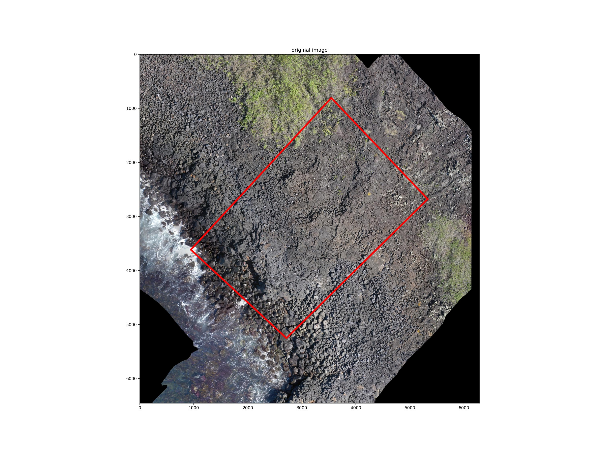
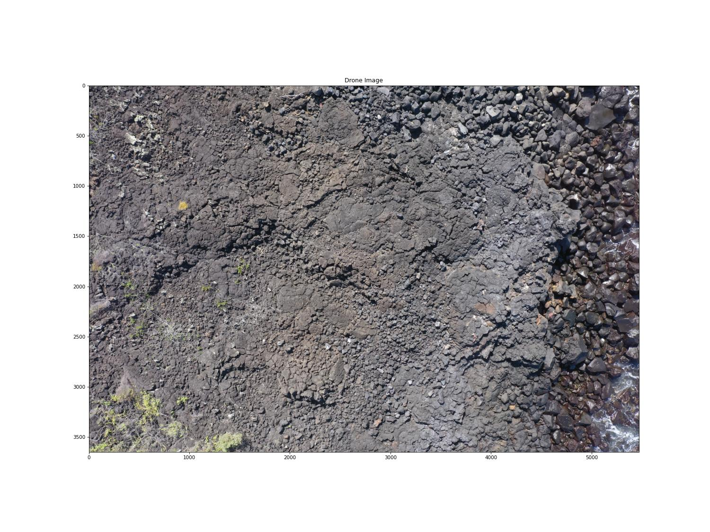
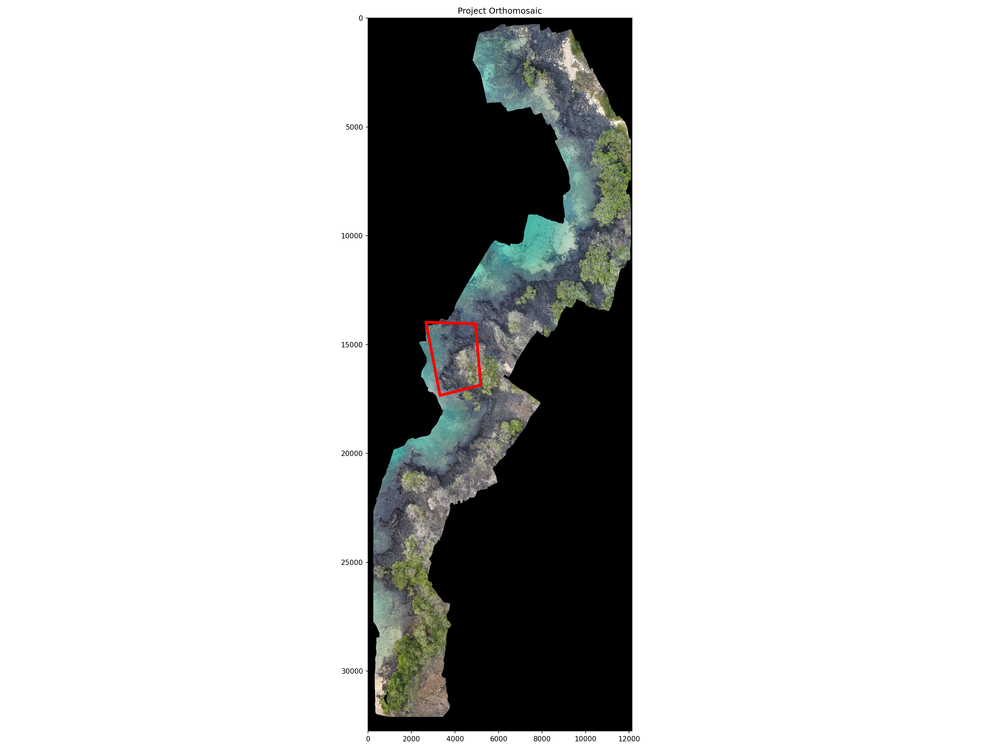

# Image Localization and Annotation Projection using Template Matching and Homography projection
This repo allows for the following workflows:

- Find a small template image in a larger image
- Project annotations from a primary image to nearby images
- Project Annotations from a primary image to an orthomosaic, correct it in a human-in-the-loop process and calculate metrics

### Helpers exists for 

- convert_images_to_cog.py to convert Orthomosaics to cloud optimized geotiffs
- clip_orthomosaic_by_drone_image_loc.py to clip a buffer around an image location from an orthomosaic using a reference drone images
- 021_geospatial_register_image_to_orthomosaic.py - geospatial registration of a drone image to an orthomosaic by a simple affine transformation




Projected image 


Full size example of a projected image


## For image localization and annotation projection, the following steps are necessary:
1. Create a config file for the template matching

011_config_generation_batch_template_matching.py is helper wrapper to generate the config file for the template matching as in examples/workflow_configs

```yaml
  # file to annotations which contains annotations for the drone image at <drone_image_path> in hasty.ai 1.1. format
  annotations_file_path: XYZ/FMO04/all_images_2024_11_10.json
  drone_image_path: XYZ/FMO04/images_2024_10_07/single_images/DJI_0066.JPG
  
  base_path: XYZ/FMO04
  # helper to crop area around the drone image to reduce template matching time
  buffer_distance: 30
  
  # temporary paths 
  interm_path: /Users/christian/PycharmProjects/hnee/image_template_search/data
  
  # Orthomosaic in which Anotations of the drone image should be projected
  orthomosaic_path: XYZ/FMO04/DD_FMO04_Orthomosaic_export_MonFeb12205040089714.tif
  
  # Output of the template matching
  output_path: /Users/christian/PycharmProjects/hnee/image_template_search/data/output/FMO04/DD_FMO04_Orthomosaic_export_MonFeb12205040089714
  
```
   
2. Run the template matching and project the annotations
012_batched_template_matching.py

you will need to set 4 variables 

```bash
# the two environment variables with your login credentials for CVAT
FIFTYONE_CVAT_PASSWORD
FIFTYONE_CVAT_USERNAME

# organissation and project_name if it exists. Set to none otherwise
organization = "IguanasFromAbove"
project_name = "Orthomosaic_quality_control"
```
This will upload an launch the cvat annotation tool, where you can correct the projected annotations.


   
3. Run the human-in-the-loop process to correct the projected annotations
- 013_batched_human_in_the_loop.py

This generate a stats.csv in the output directory:

| filename | updated_labels | new_labels | unchanged_labels | after_correction | before_correction |
|----------|----------------|------------|------------------|------------------|-------------------|
| DJI_0066.JPG | 3 | 9 | 2 | 14 | 5 |
| mt_DJI_0066_DD_FMO04_Orthomosaic_export_MonFeb12205040089714_cropped.jpg | 0 | 0 | 5 | 5 | 5 |

## Installation
```bash
conda create -n image_template_search python=3.11

conda activate image_template_search

conda install gdal
```
install LightGlue first

```bash
git clone --quiet https://github.com/cvg/LightGlue/
cd LightGlue

# install the package without output
pip install --progress-bar off --quiet -e .

# alternative to the above
pip install -e .
```

Then install the requirements
```bash
pip install -r requirements.txt
pip install -r requirements-dev.txt

# run the tests
pytest tests
```


### Further Examples
look into the notebooks


### Credits
In its core is uses Scale-invariant feature transform (SIFT) from [Lowe1999](https://www.cs.ubc.ca/~lowe/papers/iccv99.pdf) Feature Extraction and [cvg/LightGlue](https://github.com/cvg/LightGlue) for matching the features.
